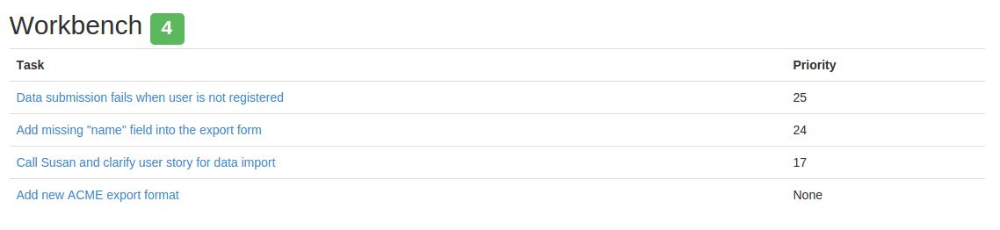
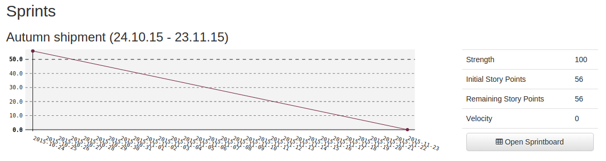

.. _dashboard:

**********
Dashboard
**********
The dashboard will give you a fast overview over your

#. Open tasks (See :ref:`workbench`) 
#. Running sprints (See :ref:`sprints`) 

.. index:: Workbench
.. _workbench:

Workbench
=========

The workbench is a **listing of the top 5 open tasks** which are assigned to you.
The tasks are ordered by the `Weight of the task` (See :ref:`task_priority`).
In case you do have more open tasks they are not listed here to keep the focus
on the most important tasks.

.. tip::
   In sake of transparency it is a good idea to only commit on tasks which you
   actually can handle in the next time. Otherwise there is the risk that this
   tasks will never get adressed by other people because you alreaday grab and
   "block" the tasks. In order to not get lost in your tasks you should try to
   keep your assigned open tasks as small as possible!

If you have more than 5 open tasks assigned than the label indicating the
amount of tasks will turn orange to indicate a warning. If you have more than
10 tasks open it will turn red to indicate danger to get lost in your many
open tasks. 

.. index:: Sprint Burndown
.. _sprints:

Sprints
=======

The sprints section will list all currently `active` sprints showing the
Burndown diagram and some statistics for each sprint. Active sprint are
sprints which are currently in the `running` state.

The :ref:`sprint_board` is reachable by clicking on `Open Sprintboard`. It
gives you a more detailed you on the current state of the sprint.
