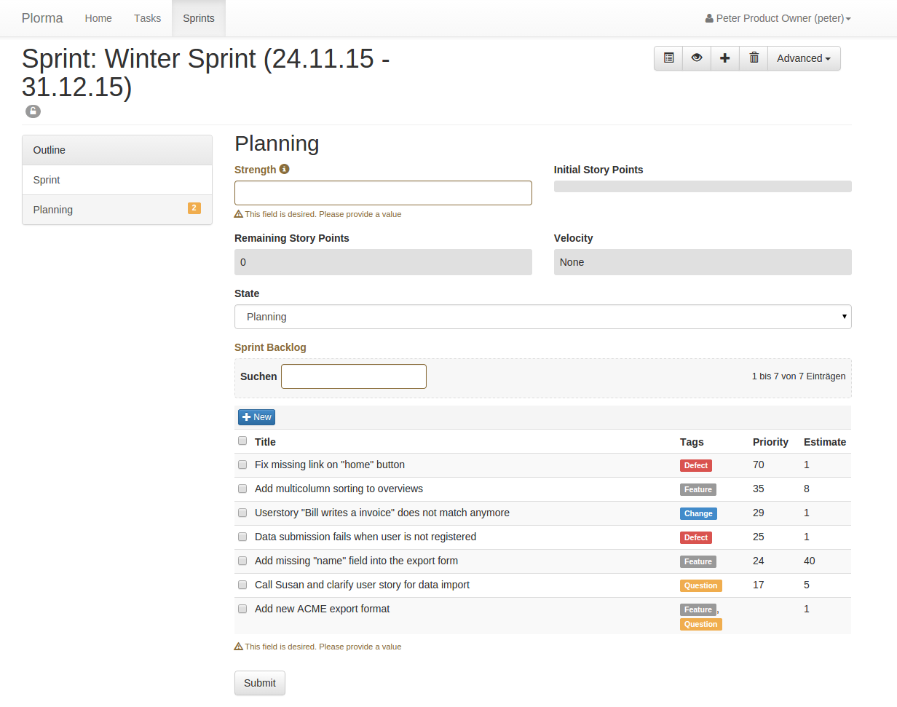
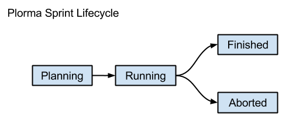
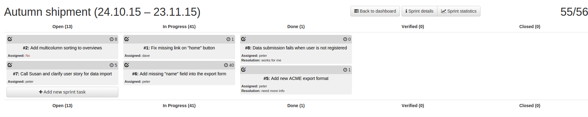
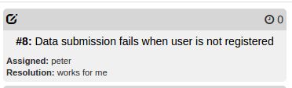

******
Sprint
******

**Title**
        The title is used to identify the sprint in various overviews and
        thus should be concise.

**Duration**
        You need to define the start and end date of the sprint. There is
        currently no automatism to finish a sprint after the end date has been
        reached.

**Description**
        Optional. You can give some information on the goals and the purpose
        of the sprint. Name your expectations and the most important business
        value which should be reached with the sprint. This information can
        help the team to keep focused on the most important tasks in the
        sprint.

.. index:: Strength

**Strength**
        Abstract value which describes the strength of the sprint team. This
        is usually the sum of time the team will spent on this sprint. The
        Strength has no unit but often reflects hours or days. The strength is
        later used to calculate the velocity of the sprint.

**Estimate**
        This info field sums up the remaining Story Points in this sprint.

**Initial Story Points**
        This field will show the sum of Story Point of the initial tasks in
        the sprint. The value will be calculated when changing from `planning`
        to `running` state of the sprint. The value is used to calculate the
        progress in the sprint.

**State**
        The sprint can be in one state of the :ref:`sprint_lifecycle`

.. index:: Sprint Backlog

**Backlog**
        The Backlog show all assigned tasks to this sprint. While the Sprint
        is in `planning` state the Backlog lists all open tasks. The tasks are
        ordered by the :ref:`task_priority` so the most important tasks are
        listed.

.. _sprint_lifecycle:

Lifecyle
========

======== ===================================================================
State    Description
======== ===================================================================
Planning The Sprint is not visible to other users in the :ref:`sprints`
         section of the :ref:`dashboard`. All field are editable. The Backlog
         will show all open tasks. Tasks can be added or removed.
Running  The start the sprint you need to provide the strength of the team and
         assign at least on task to the Sprint Backlog. In this state the
         Sprint is visible to other users in the :ref:`sprints` section of the
         :ref:`dashboard`.  Only the state field is editable.  Tasks can not be
         added or removed.
Finished The sprint has been terminated in a normal way after the end date has
         been over. The sprint will not be listed to other users anymore.
Aborted  The sprint has been aborted by the Productowner for any reasons. The
         sprint will not be listed to other users anymore.
======== ===================================================================

.. index:: Sprint Board
.. index:: Kanban
.. _sprint_board:

Sprint Board
============

The Sprint Board is the major tool while working on the sprint. It gives an
detailed overview of the current state of the sprint and allows to quickly
document the progress in the sprint or add new items to the sprint. In the
right top corner you can see the **total remaining Story Points**.

The Sprint Board is basically a Kanban Board with the following columns. Each
column show **remaining Story Points per state**. The states are ordered by the
:ref:`task_priority`.

**Open**
        Lists all open tasks. Open are tasks with one of the following the
        :ref:`task_states`: *new*, *open* or *reopen*.
**In Progress**
        Lists all tasks which are in the *assigned* state.  That means that
        someone is actually working on this task.
**Resolved**
        Resolved tasks are tasks on which the work has been stopped for
        different reasons. The one who worked on the issue before stopped
        working on the issue. This can be either because the task is really
        finished or needs some input or is waiting. The reason why a task has
        been resolved is the :ref:`task_resolution`. However: **Resolved tasks
        are not done! They need further work or at least a decision on how to
        proceed with them**.

**Verified**
        The resolution of a resolved task has been verified. It is very likely
        that the task will pass final QA and meets the Definition of Done. It
        is accepted by the team as a valid solution. The task is almost done.
**Closed**
        The task is finally done. No work left. The tasks has passed final QA
        (e.g Testpushes) and meets all points of the Definition of Done.

.. index:: Taskcard
.. _sprint_taskcard:

Taskcards
---------

Each Taskcard represents a single task in the current sprint. The Taskcards
provide minimal required information in the context of the current state of
the task. So if a task is in the *resolved* state the Taskcard will also
provide the *resolution* of the task. If the task is missing important aspects
like and assignee or an estimation than the missing value is indicated by red
color.

Clicking on the title of the Task will open a reduced form to set
basic attributes of the task. You can add comments, move the task in a
different state or adapt the estimation of the task. After saving the task you
will go back to the Sprint Board. This way you can quickly document the
progress in the sprint and optimize the transparency in the process. By
clicking on the edit icon in the top left corner you will get a detailed form
of the task.
