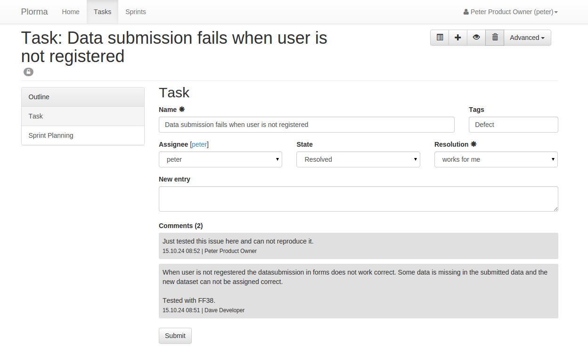
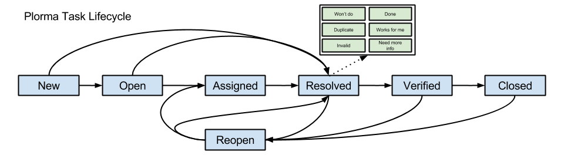

****
Task
****

**Name**
        Every task must have a short name which ideally sums up the task in a
        few words. The name is used in the task overview to identify the task.

.. index:: Tagging

**Tags**
        The tasks can be tagged with different tags to help organising the
        tasks. The tags will be displayed in the task overview.
        Tags can only be created by User with the role `productowners`.

.. index:: Responibility
.. index:: Assignee

**Assignee**
        A task can be assigned to other users. Assigning a task to a user
        means that this user is responsible to work on the task.

.. index:: Resolution
.. index:: State

**Task State**
        The :ref:`task_states` and :ref:`task_resolution` can be set in . Some
        of the fields will become a required field based on the current state
        and selections. So the *Resolution* field will become a required field
        when switching into the resolved state.

.. index:: Comments
.. index:: Discussion

**Comments**
        Users can add comments to give further information, or
        document their proceed. Comments are readable by all users.

.. index:: Priority

**Priority**
        The priority (:ref:`task_priority`) will influence the order of the
        task in the task overview or product backlog.

        ========= =========================================================
        Priority  Description
        ========= =========================================================
        immediate Must be fixed immediately (means: "Drop any other work").
                  Reports must have an assignee set in the "Assigned to"
                  field.
        very high Should be fixed as next task by maintainers and certainly before the
                  next release.
        high      Not the next task, but should be fixed soon. Depending on teams &
                  manpower this can take between one and six months.
        normal    Medium priority; would be good to get fixed somewhere in the future.
                  Contributed patches might speed fixing up.
        low       This can be fixed, but we're not going to worry about it.  Patches
                  very welcome and required for progress.
        very low  This can be fixed, but we're not going to worry about it.  Patches
                  very welcome and required for progress.
        ========= =========================================================

        Usually only the priorities from *very low* to *very high* should be
        used for task planning.

        The *immediate* priority is a special one. It should only be used in very
        rare cases as it really means that any other work should be dropped
        which may affect running sprints.

.. index:: Severity

**Severity**

        ======== ==========================================================
        Severity Description
        ======== ==========================================================
        Blocker  Blocks further development and/or testing work
        Critical Crashes, loss of data (internally, not your edit preview!)
                 in a widely used and important component.
        Major    Major loss of function in an important area.
        Normal   Default/average
        Minor    Minor loss of function, or other problem that does not
                 affect many people or where an easy workaround is present.
        Trivial  Cosmetic problem like misspelled words or misaligned text 
                 which does not really cause problems
        ======== ==========================================================

.. index:: Estimation

**Estimation**

        The estimate indicates how much work remains to be done until the task
        is completely resolved. The estimate can be selected from a simplified
        Fibonacci sequence to regard larger inaccuracy in complex tasks.

        The estimate does not have any time unit like hours. It is a abstract
        estimate and needs to be interpreted individual. The estimate can be
        used as Story Points in a Scrum development process.

**Sprints**
        The sprint listing will show a list of Sprints which are currently in
        the planning state. You can assign tasks to more than on sprint.

Lifecycle
=========

.. _task_states:

States
------

======== ===================================================================
State    Description
======== ===================================================================
New      Initial state for all new created tasks. Nobody has looked into the
         task nor it has been checked to be a valid.
Open     The tasks has been checked to be valid. However the task has not been
         assigned to someone yet.  But based on its :ref:`task_priority` it is
         queued to be worked on.
Assigned The tasks has been assigned to a developer.  He will start to work on
         the task based on its priority.
Resolved Work on the task has been finished with on of the possible
         :ref:`task_resolution`.
Verified The resolution has been accepted by the QA. Last steps can be made to
         finally close the task.  Verifying the solution of a task will set
         the remaining estimate to 0.
Closed   The final state of a task. The task has been resolved the QA has
         approved the resolution.  The resolution has been communicated to all
         relevant parties. Closing a task will set the remaining estimate to
         0.
Reopen   Indicates that an issue has been reopened for some reason. This my be
         a failed QA or later upcoming issues with the solution. Reopening the
         task will set the estimate to a unknown value to enforce the user to
         set a new value for the estimate.
======== ===================================================================

.. _task_resolution:

Resolutions
-----------

============== =============================================================
Resolution     Description
============== =============================================================
Done           Task is done and is ready for QA.
Works for me   Can not reproduce the defect or issue. Everything works as
               expected.
Need more info It is unclear what exactly to do here. More information is 
               needed before the work can continue here.
Won't do       Task will not be resolved for any reason.
Duplicate      Task is duplicate of another task.
Invalid        Task is invalid and will not be done for any other reason the
               formed named resolutions.
============== =============================================================

.. index:: Weight of a task
.. _task_priority:

Weight of a task
================
The prioritization of the task is calculated based on its Priority (think of
importance) and its severity. The following formula shows how the value is
basically calculated.

In Plorma the calculated value is called the *Taskweight*. The range to the
priority is (1,0.85,0.7,0.5,0.35,0.2). The Taskweight is used in the task
overview are prioritization criteria.

If either the priority or the severity is not set, than the weight can
not be calculated and is unknown.
