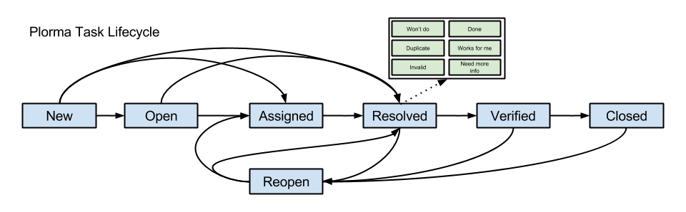

****
Task
****
.. image:: ../images/screenshots/task_edit.png
   :width: 800 px
   :alt: Plorma task editing

Every task must have a short title (1) which ideally sums up the task in a few
words. The title is used in the Taskoverview to identify the task.

The :ref:`task_priority` can be done in (2). Note that the priority is grayed
out. This is because the priority can only be set by the product owner.

The :ref:`task_states`, :ref:`task_resolution` and the *Assigne* can be set in
(3). Some of the fields will become a required field based on the current
state and selections. So the *Assignee* field will become a required field
when switching into the assigned state.  The *Resolution* field and will
become a required field if the task will be resolved.

Finally users can add comments (4) to give further information, or document
their proceed. Comments are readable by all users.

Lifecycle
=========

.. _task_states:

States
------

**New**
        Initial state for all new created tasks. Nobody has looked
        into the task nor it has been checked to be a valid.

**Open**
        The tasks has been checked to be valid. However the task has not been
        assigned to someone yet. But based on its :ref:`task_priority` it is
        queued to be worked on.

**Assigned**
        The tasks has been assigned to a developer. He will start to work on
        the task based on its priority.

**Resolved**
        Work on the task has been finished with on of the possible :ref:`task_resolution`.

**Verified**
        The resolution has been accepted by the QA. Last steps can be made to
        finally close the task.

**Closed**
        The final state of a task. The task has be resolved the QA has
        approved the resolution. The resolution has been communicated to all
        relevand parties.

**Reopen**
        Indicates that an issue has been reopened for some reason. This my be a
        failed QA or later upcoming issues with the solution.

.. _task_resolution:

Resolutions
-----------
**Done**
        Task is done and is ready for QA.
**Works for me**
        Can not reproduce the defect or issue. Everything works as expected.
**Need more info**
        It is unclear what exactly to do here. More information is needed
        before the work can continue here.
**Won't do**
        Task will not be resolved for any reason.
**Duplicate**
        Task is duplicate of another task.
**Invalid**
        Task is invalid and will not be done for any other reason the
        formed named resolutions.

.. _task_priority:

Prioritization of the tasks
===========================
The prioritization of the task is based on its Priority (think of importance) and
its severity.

.. note:: 
        The defintions of the priority and the severity is shameless taken
        from the bugzilla definition.

Priority
--------
The priority can only be set by the product owner.

**immediate**
        Must be fixed immediately (means: "Drop any other work"). Reports must
        have an assignee set in the "Assigned to" field.
**very high**
        Should be fixed as next task by maintainers and certainly before the
        next release. Reports should have an assignee set in the "Assigned to"
        field.
**high**
        Not the next task, but should be fixed soon. Depending on teams &
        manpower this can take between one and six months.  * normal: Medium
        priority; would be good to get fixed somewhere in the future.
        Contributed patches might speed fixing up.
**low**
        This can be fixed, but we're not going to worry about it.  Patches
        very welcome and required for progress.
**very low**
        This can be fixed, but we're not going to worry about it.  Patches
        very welcome and required for progress.

Severity
--------
The severity must be set initially set by the developer.

**Blocker**
        Blocks further development and/or testing work
**Critical**
        Crashes, loss of data (internally, not your edit preview!) in a widely used and important component.
**Major**
        Major loss of function in an important area.
**Normal**
        Default/average
**Minor**
        Minor loss of function, or other problem that does not affect many people or where an easy workaround is present.  
**Trivial**
        Cosmetic problem like misspelled words or misaligned text which does not really cause problems.
